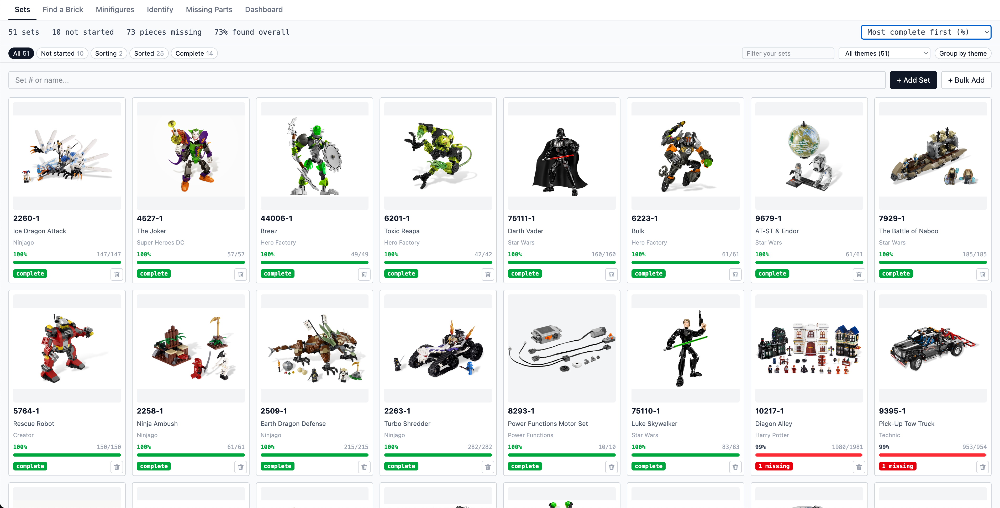
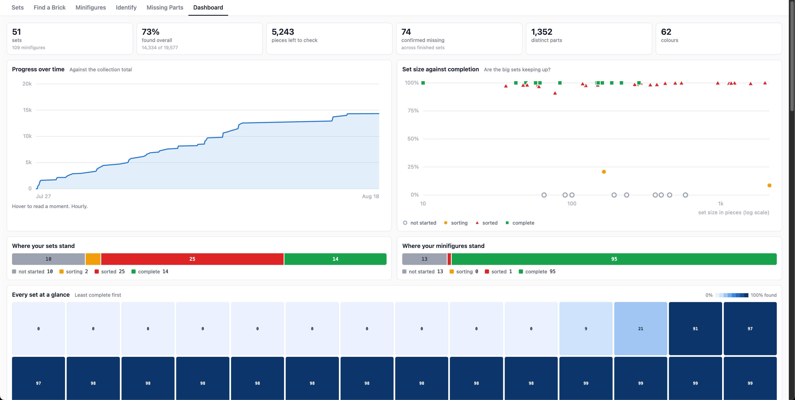
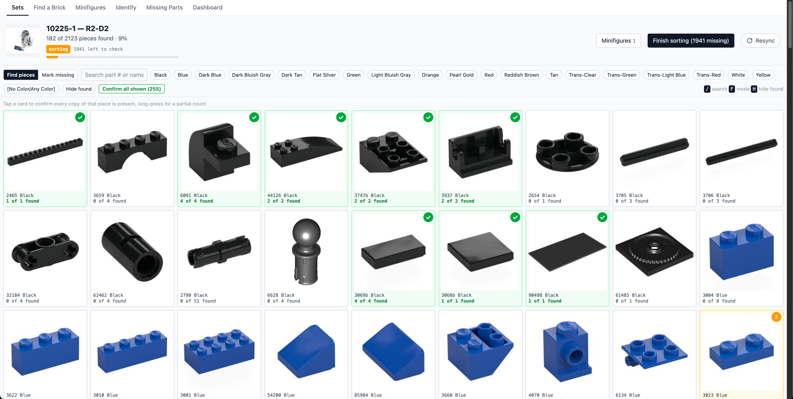
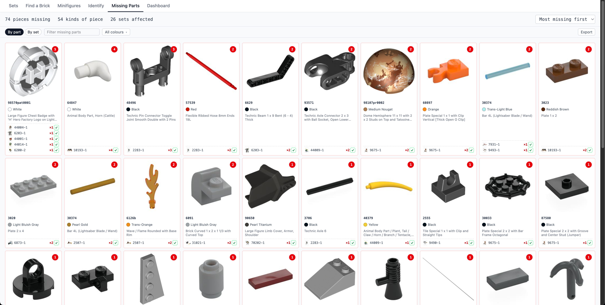
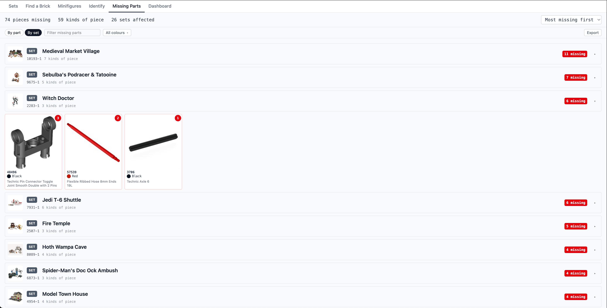
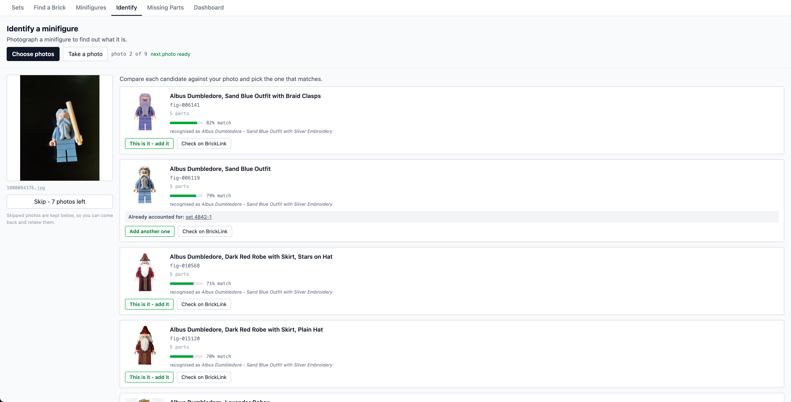
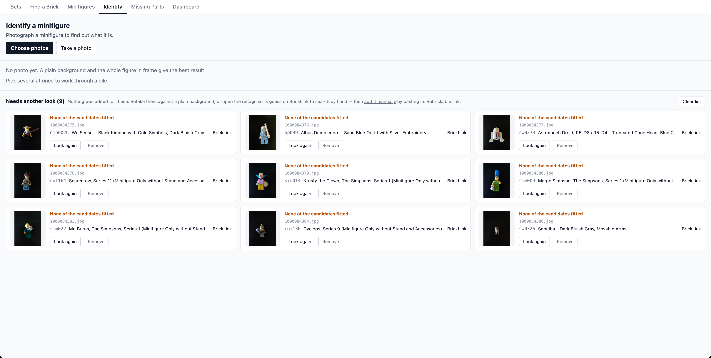

# Brickoncile

[](https://github.com/anton-p0g/Brickoncile/actions/workflows/ci.yml)
[](https://github.com/anton-p0g/Brickoncile/releases)

Brickoncile is a self-hosted web app for inventorying a LEGO collection. Add a set, work through its parts, and record what you find. When the sort is finished, Brickoncile keeps a clear list of anything that is still missing.

It is useful for checking second-hand sets, rebuilding sets from a mixed collection, sorting a childhood collection, or keeping track of loose minifigures. Everything is presented visually, so you can spend less time working from spreadsheets and part lists.

## Preview

[](docs/screenshots/sets-overview.png)

| Dashboard                                                                                                                                 | Sorting a set                                                                                                    |
| ----------------------------------------------------------------------------------------------------------------------------------------- | ---------------------------------------------------------------------------------------------------------------- |
| [](docs/screenshots/dashboard.png) | [](docs/screenshots/set-sorting.png) |

| Missing pieces                                                                                                       | Missing pieces by set                                                                                             |
| -------------------------------------------------------------------------------------------------------------------- | ----------------------------------------------------------------------------------------------------------------- |
| [](docs/screenshots/missing-by-part.png) | [](docs/screenshots/missing-by-set.png) |

| Identifying a minifigure                                                                                                                            | Reviewing unmatched photos                                                                                                          |
| --------------------------------------------------------------------------------------------------------------------------------------------------- | ----------------------------------------------------------------------------------------------------------------------------------- |
| [](docs/screenshots/identify-minifigure.png) | [](docs/screenshots/identify-review.png) |

## Features

### Set inventory

- Add one set or paste a list of set numbers in bulk.
- Fetch the set name, year, theme, image, parts, colours, quantities, and included minifigures.
- Search, sort, filter by status or theme, and group the collection by theme.
- Resync a set if its source inventory changes.

### Piece-by-piece sorting

- View every required piece as a visual grid.
- Confirm a whole part line or record a partial quantity by long pressing the icon.
- Switch between finding pieces and marking pieces as missing.
- Filter by part number, name, colour, or completion state.
- Confirm all currently filtered parts at once.
- Undo recent changes and review the history of a sorting session.

Brickoncile separates pieces that have not been checked yet from pieces that are confirmed missing. Unaccounted pieces only enter the missing-parts list when you finish sorting a set or minifigure.

### Minifigures

- Track minifigures included with owned sets.
- Add loose minifigures by Rebrickable link or figure ID.
- Keep multiple copies of the same minifigure.
- Track the parts and completion of each physical copy separately.
- Photograph one or several minifigures and review likely matches.
- Reassign a minifigure if it was filed under the wrong catalog entry.

### Find a brick

Enter the number moulded into a piece, an element ID, or part of its name. Brickoncile searches your collection and shows which sets and minifigures use it, how many copies they need, and whether those copies are already accounted for.

This is useful when sorting a mixed pile and asking, "Where does this piece belong?"

### Missing parts

- Combine confirmed missing pieces across sets and minifigures.
- Group results by part or by source.
- Search, filter by colour, and sort the list.
- Record a recovered piece directly from the missing-parts page.
- Copy the list as text or export it as CSV.

### Dashboard

The dashboard summarizes the collection with totals and progress charts. It includes completion over time, sorting status, collection themes, release years, colours, commonly used parts, most-wanted pieces, set completion, and minifigure ownership.

## External services

Brickoncile uses two external APIs:

- [Rebrickable API](https://rebrickable.com/api/) provides set metadata, inventories, themes, minifigures, part details, and source images. You need a free Rebrickable API key to add and resync catalog entries.
- [Brickognize](https://brickognize.com/) provides image recognition for the minifigure identification feature. A photo is sent to Brickognize only when you choose to identify it. Brickoncile then searches Rebrickable for likely catalog matches and asks you to confirm the result.

The collection itself is stored locally. Images fetched while using the app are cached locally so the interface remains quick and previously loaded entries do not depend on every source image being available.

## Run with Docker

### Requirements

- Docker with Docker Compose
- A [Rebrickable API key](https://rebrickable.com/api/)

Clone the repository:

```bash
git clone https://github.com/anton-p0g/Brickoncile.git
cd Brickoncile
```

Create your local environment file:

```bash
cp backend/.env.example backend/.env
```

Open `backend/.env` and replace the placeholder with your Rebrickable API key:

```env
REBRICKABLE_API_KEY='your_key_here'
```

Start Brickoncile:

```bash
docker compose up -d
```

Open [http://127.0.0.1:8000](http://127.0.0.1:8000).

Check the container and follow its logs:

```bash
docker compose ps
docker compose logs -f
```

Press `Ctrl+C` to stop following the logs. The container will keep running in the background.

### Stop Brickoncile

```bash
docker compose down
```

This removes the container but keeps your database and images.

### Update Brickoncile

Pull the latest image and recreate the container:

```bash
docker compose pull
docker compose up -d
```

To run a specific release instead of `latest`:

```bash
BRICKONCILE_VERSION=0.1.0 docker compose up -d
```

## Tech stack

- FastAPI, SQLModel, and SQLite
- React, TypeScript, Vite, and Tailwind CSS
- Docker and Docker Compose
- GitHub Actions and GitHub Container Registry

## Contributing

Bug reports, ideas, and pull requests are welcome!

## Acknowledgements

Catalog data and images are provided by Rebrickable. Photo recognition is provided by Brickognize.

Brickoncile is an independent project and is not affiliated with or endorsed by the LEGO Group, Rebrickable, BrickLink, or Brickognize. LEGO is a trademark of the LEGO Group.
